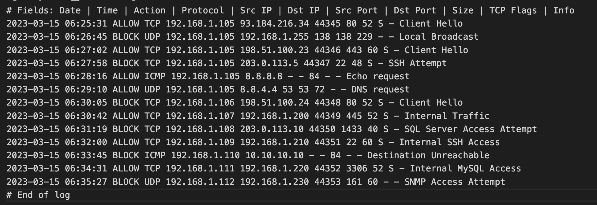
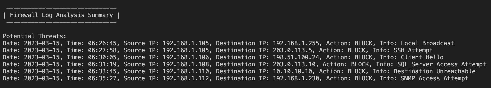

# Firewall Log Analyzer

**Author:** Thushitharan M

## Installation

```
git clone https://github.com/thushi99/firewall-log-analyzer.git
```

This Python script is designed to parse and analyze firewall logs, providing insights into potential threats based on blocked traffic entries. The script can be useful for enhancing network security by identifying and reporting suspicious activities.

## Usage

1. **Clone the Repository:**
   ```bash
   git clone https://github.com/your-username/firewall-log-analyzer.git
   cd firewall-log-analyzer
   ```
2. **Change Directory:**
   ```bash
   cd firewall-log-analyzer
   ```
3. **Run the file:**
   ```bash
   python firewall_log_analyzer.py <path_to_log_file>
   ```

## Screenshots
**Input(Firewall logs):**


**Output:**
